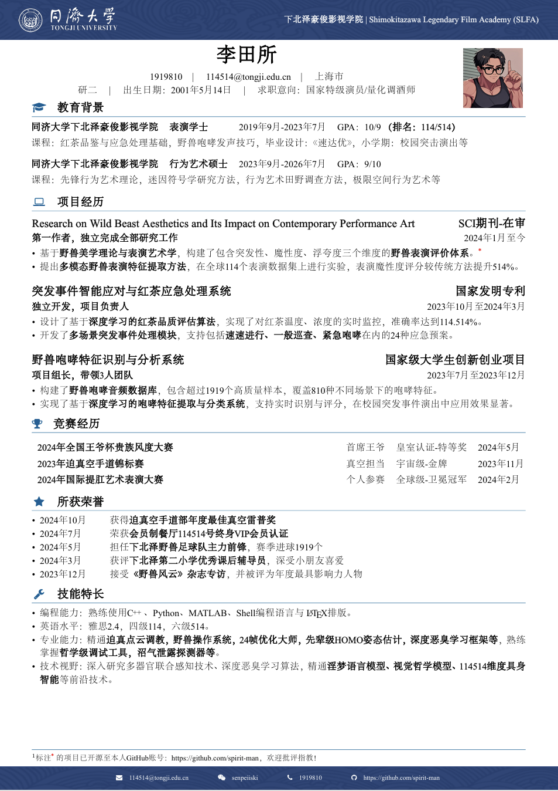

# TONGJI_resume_template

野兽先辈于同济大学下北泽豪俊影视学院就读期间熟肉简历流出，热直肠的先辈希望能够帮助更多后辈（大误）

从**NPU CV**修改来的同济版本，感谢 https://www.overleaf.com/latex/templates/npu-cv/mncqzxhvfzrx

## 主要修改内容
- 优化了**字体设置**，在一页内排版完全部内容
- 重新设计了**个人信息的排版布局**

## 简历效果


## 使用说明
1. 字体设置：fonts中可以替换为其他字体
2. 在需要调整节间间距的地方使用`\vspace{数值}`，如：
```latex
\section{教育经历}
\vspace{0.5cm}  % 可以根据需要调整数值
```
如果这个模板对您有帮助，欢迎点个⭐支持一下～您的支持是**先辈古道热肠**的动力！
